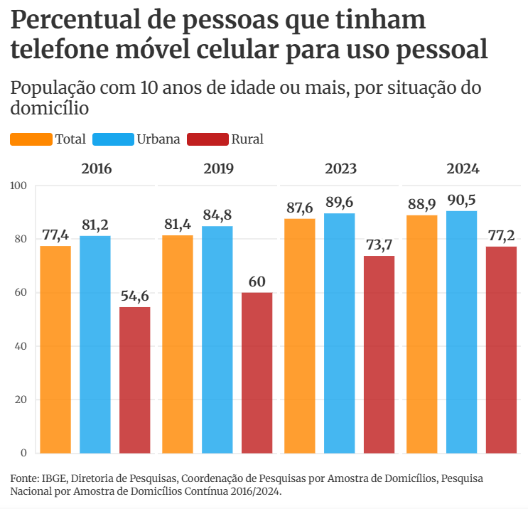
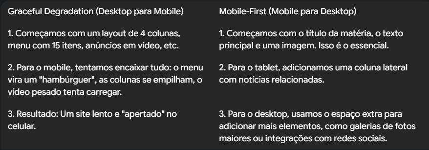
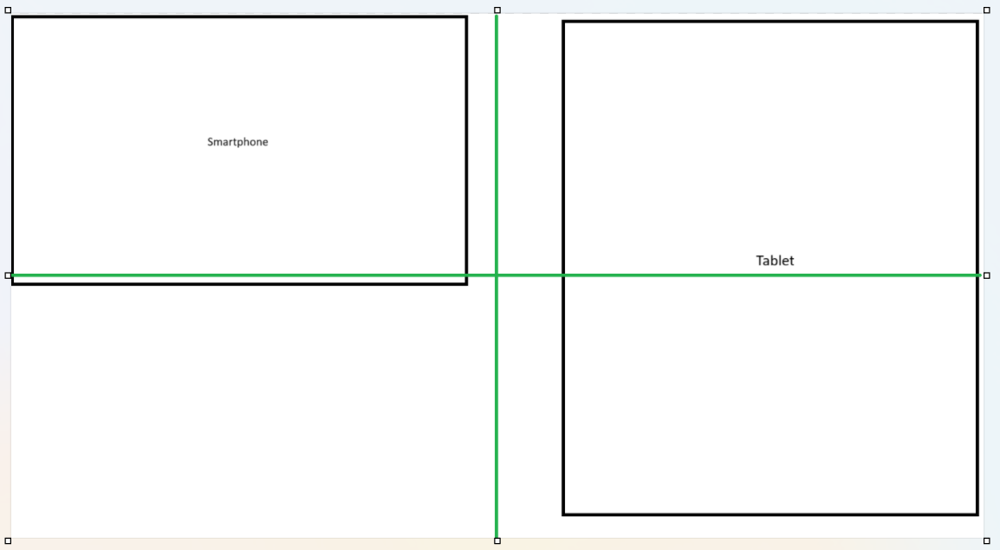

# Aula 01 📺 - Aula 01

## 🎯 - Objetivos
 - O cenário Mobile atual: Por que começar pelo celular?
 - Duas abordagens: Graceful Degradetion vs. Progressive Enhancement
 - A filosofia Mobile First
 - Benefícios: foco, performance e melhor experiência do usuário
 - Configuração do ambiente de desenvolvimento
## 📣 - Primeiro modelo
> **Prática em sala**: usando uma folha de papel, lápis, lápis de cor ou outros materiais crie a diagramação básica de um site de notícias para a escola do SENAC Gravataí. \
**Tempo:** 15 minutos

. \
. \
. \
. \
. \
. \
. \
. \
. \
. \
. \
. \
. \
. 
---

## 📱 - O mundo é **mobile**
O Brasil possui cerca de 480 milhôes de dispositivos digitais, sendo 258 milhões de smartphones e 222 milhões de computadores. - Reportagens do Portal FGV e Veja.
A população estimada para nosso País em 2025 é de 213 milhões de habitantes.

Em pesquisa realizada pela Pesquisa Nacional por Amostra de Domicílios Contínua (PNAD), divulgada em 24/07/2025 pelo Instituto Brasileiro de Geografia e Estatística (IBGE) referente ao acesso à smartphones e Internet referente ao ano de 2024, 9 entre 10 brasileiros com idade acima de 10 anos tinham este acesso.

 \
[Link para notícia completa](https://www.metropoles.com/brasil/ibge-9-em-cada-10-usam-celular-e-internet)

Entretanto nem tudo são "flores", a desigaldade social também chega ao mundo virtual. Como não é foco da nossa disciplina não entraremos em maiores detalhes, apenas trazendo como ponto a ser devidamente avaliado e nunca esquecido durante os processos criativos da disciplina. [Link para notícia do CGI.br](https://www.observatoriodaimprensa.com.br/digital/acesso-a-internet-no-brasil-reproduz-desigualdades-e-exige-politicas-publicas/)

O acesso à internet via dispositivos móveis ultrapassou o desktop há anos e a tendência continua crescendo.
* No Brasil (2023): Mais de 80% dos acessos à internet são feitos via smartphones.
* Implicação: Se o seu site não funciona bem em um celular, ele não funciona bem para a maioria dos seus usuários.

**O dispositivo móvel não é uma versão "menor" da web. É a principal forma de acesso.**

### Porque mobile?
Um ponto muito importante é definir o motivo do projeto "ser mobile". Simplesmente pelo fato que vimos acima? Realmente não é uma boa decisão. É necessário identificar os objetivos a serem atingidos, qual o público-alvo e do que este público precisa? Respondendo estas perguntas podemos definir que um *app* é a melhor solução, ou que um site mobile será a grande sacada ou ainda que nosso projeto não precisa nada disto, um site bem estrturado para desktop resolve tudo.
Do ponto de vista do usuário, desde que veja o design apropriado para o dispositivo que ele está usando, a escolha entre as opções de implementação são uma decisão de engenharia, e não de usabilidade, conforme Jakob Nielsen.

App vs. Web
App pode nos proporcionar melhor acesso, integração ao hardware e a plataforma.
Web trás independência de plataforma e portabilidade.

Design Responsivo
A alguns anos os sites tinha "tamanho padrão", hoje é tudo flexível, adaptável. Hoje a responsividade nós trás esta característica de ajustar o conteúdo do tamanho da tela.

Mobile First
Quando pensamos em criar nosso site, pensamos primeiro em dispositivos móveis ou em um computador? Devemos considerar que na tela do computador "cabe" muito mais coisa que na tela do telefone. Não estou falado só em resolução, temos de considerar velocidade de acesso (mesmo que hoje já tenhamos o 5G) e outras variáveis.

---
## 🚀 - Graceful Degradetion
- **Fluxo:** Desktop -> Tablet -> smartphone
- **Como funciona:** Você projeta e desenvolve a experiência completa para o desktop e, em seguida, remove ou adapta funcionalidades para que o site "não quebre" em telas menores.
- **Mentalidade:** "Como podemos fazer essa experiência complexa caber em uma tela pequena?"
- **Problema:** Geralmente resulta em sites mobile mais lentos, sobrecarregados e com uma experiência de usuário adaptada, não planejada.

---
## 🎨 - Progressive Enchancement
- **Fluxo:** Mobile -> Tablet -> Desktop.
- **Como funciona:** Você projeta e desenvolve a experiência essencial para o ambiente mais restrito (mobile). Em seguida, aprimora e adiciona funcionalidades e elementos de layout para telas maiores, que possuem mais espaço e recursos.
- **Mentalidade:** "Qual é o conteúdo e a funcionalidade mais importante? Vamos garantir que isso funcione perfeitamente no celular e depois aprimorar."

**Esta é a base do Mobile-First.**

---
## 💡- Exemplo prático

- Imagine um site de notícias:

---
## 🌍 - Mobile First
O *mobile fist* é uma abordagem de design e desenvolvimento de sites e aplicativos onde é prioirizado a experiência de usuários de dispositivos móveis. Quando se planeja o desenvolvimento para *mobile* devemos considerar toda a estrutura para funcionar eficientemente em telas menores e com hardware mais limitado. Isto evitará problemas de incompatibilidade e garantir uma navegação mais fluída para o usuário.
**Vantagens:**
- Melhor experiência de usuário
- Aumento da eficiência do design
- Melhor acessibilidade
- Desempenho superior do site
- Otimizações de SEO

### 📦 - Criando um site com Mobile First
1) Identificar as necessidade do usuário
2) Crie um esboço do site
3) Teste o esboço do site
    - Wireframe ou HTML simples
4) Crie o design final
    - Paleta de cores
    - Tipografia
    - Espaço em branco
    - Sistemas de grid
    - Ícones de navegação
    - Destaque para botões e links
5) Desenvolva o site
    - Site ou Tema
6) Teste o site
7) Otimize o site
    - Hospedagem
    - CDN
    - Otimização de imagens
    - Uso de cache
    - Compactação
    - Use HTTPS
    - Otimize SEO
    - URLs amigáveis
    - Velocidade

---
## 🧑‍💻 - Prática
Com base no modelo criando anteriormente para o site, avalie agora uma nova concepção tendo a ideia de modelar primeiro para mobiles.
1) Reestruture o site pensando em criar primeiro para celular (428px);
2) Reestruture o site pensando em acesso via tablet (1024px);
3) Reestruture o site pensando em acesso via computador ou notebook (1728px).

### Modelo de divisão folha A4 para a modelagem
1) Para smartphone e tablet, usar o modelo abaixo como padrão

2) Para tela do computador/notebook usar a folha A4 inteira como padrão.