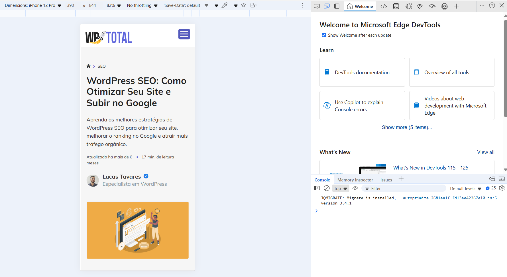

# 💬 - Aula 03

## 🎯 - Objetivos

## 🏗️ - Integração HTML e CSS

> Existem três formas de integrar o CSS com HTML, usando CSS externo, CSS interno ou CSS inline.

### 1) CSS Externo

&nbsp;&nbsp;&nbsp;&nbsp;&nbsp;É o método mais indicado, pois mantém o código organizado e facilita a reutilização de estilos.
    - Crie um arquivo CSS separado, por exemplo `estilo.css`
    - No arquivo HTML, a tag `<link>` dentro do `<head>` para conectar o CSS externo

#### Exemplo prático

`index.html`

```htmml
<!DOCTYPE html>
  <html lang="pt-BR">
  <head>
    <meta charset="UTF-8">
    <meta name="viewport" content="width=device-width, initial-scale=1.0">
    <title>Exemplo de CSS Externo</title>
    <link rel="stylesheet" href="estilos.css">
  </head>
  <body>
    <h1>Olá, Mundo!</h1>
  </body>
</html>
```

`estilo.css`

```css
h1 {
  color: blue;
  font-family: Arial, sans-serif;
}
```

### 2) CSS Interno

&nbsp;&nbsp;&nbsp;&nbsp;&nbsp;O CSS é escrito diretamente dentro do arquivo HTML, dentro de uma tag `<style>` no `<head>`.

#### Exemplo prático

`index.html`

```htmml
<!DOCTYPE html>
  <html lang="pt-BR">
    <head>
      <meta charset="UTF-8">
      <meta name="viewport" content="width=device-width, initial-scale=1.0">
      <title>Exemplo de CSS Interno</title>
      <style>
        h1 {
          color: green;
          font-family: Verdana, sans-serif;
        }
      </style>
    </head>
    <body>
      <h1>Olá, Mundo!</h1>
    </body>
</html>
```

### 3) CSS Inline

&nbsp;&nbsp;&nbsp;&nbsp;&nbsp;Os estilos são aplicados diretamente no elemento HTML usando o atributo `style`. Este método é menos recomendado pois dificulta qualquer manutenção no código.

#### Exemplo prático

`index.html`

```htmml
<!DOCTYPE html>
  <html lang="pt-BR">
    <head>
      <meta charset="UTF-8">
      <meta name="viewport" content="width=device-width, initial-scale=1.0">
      <title>Exemplo de CSS Inline</title>
    </head>
    <body>
      <h1 style="color: red; font-family: 'Courier New', monospace;">Olá, Mundo!</h1>
    </body>
</html>
```

## 🗂️ - Explorando DevTools no desenvolvimento
> &nbsp;&nbsp;&nbsp;&nbsp;&nbsp;Para que possamos acessar as ferramentas de desenvolvimento do navegador, usamos a tecla `F12`. Temos diversos itens que podemos explorar para avaliar o funcionamento da nossa página, mas o que nos interessa neste momento é a **Toggle Device Toolbar**. Nesta ferramenta podemos mudar a resolução do nosso navegar para que possa funcionar de forma semelhante aos *mobile*. Podemos visualizar todos os elementos HTML inseridos no nosso projeto como também visualizar os estilos aplicados. Veja o print abaixo:



## 📦 - Implementando reset CSS
> &nbsp;&nbsp;&nbsp;&nbsp;&nbsp;Outra questão importante, muitas vezes os navegadores deixam "sujeira" de **CSS** acessados anteriormente ou simplesmente usam valores de estilos padrão internos do navegador, isto ocorre usualmente com as **margens**. Assim uma boa ideia pode ser executar o **reset** no **CSS**. Podemos procurar e usar o **CSS Tools: Reset CSS** do **Meyerweb** ou criar um arquivo copiando o conteúdo abaixo:

`reset.css`
```css
/* http://meyerweb.com/eric/tools/css/reset/ 
   v2.0 | 20110126
   License: none (public domain)
*/

html, body, div, span, applet, object, iframe,
h1, h2, h3, h4, h5, h6, p, blockquote, pre,
a, abbr, acronym, address, big, cite, code,
del, dfn, em, img, ins, kbd, q, s, samp,
small, strike, strong, sub, sup, tt, var,
b, u, i, center,
dl, dt, dd, ol, ul, li,
fieldset, form, label, legend,
table, caption, tbody, tfoot, thead, tr, th, td,
article, aside, canvas, details, embed, 
figure, figcaption, footer, header, hgroup, 
menu, nav, output, ruby, section, summary,
time, mark, audio, video {
    margin: 0;
    padding: 0;
    border: 0;
    font-size: 100%;
    font: inherit;
    vertical-align: baseline;
}
/* HTML5 display-role reset for older browsers */
article, aside, details, figcaption, figure, 
footer, header, hgroup, menu, nav, section {
    display: block;
}
body {
    line-height: 1;
}
ol, ul {
    list-style: none;
}
blockquote, q {
    quotes: none;
}
blockquote:before, blockquote:after,
q:before, q:after {
    content: '';
    content: none;
}
table {
    border-collapse: collapse;
    border-spacing: 0;
}
```

> &nbsp;&nbsp;&nbsp;&nbsp;&nbsp;Para que possamos executar então este *reset*, precisamos incluir nosso `reset.css` antes dos demais **CSS** que vamos usar.

#### Exemplo

`index.html`
```html
<!-- Codigo omitido -->
  <head>
    <link rel="stylesheet" href="reset.css">
    <!-- Codigo omitido -->
```

## Exercício
1) Com base na demo que se encontra na pasta [code](https://github.com/emersoninocente/tds-uc15/tree/main/aula-03/code). Separe todo o conteúdo referente ao estilo, criando um arquivo de estilo `.css` e importe no `HTML`. Faça a mesma coisa para o `javascript` criando um arquivo `.js`